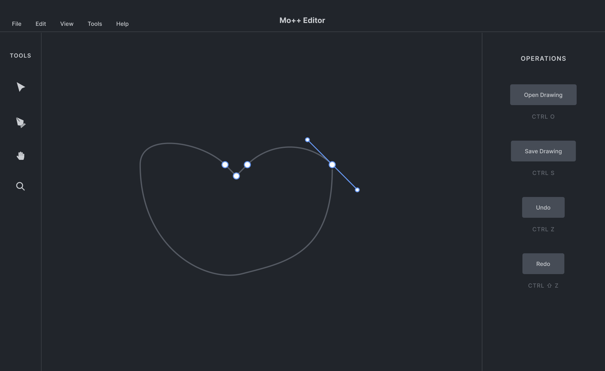

# Mo++

This prototype application demonstrates two major experimental functions:

1. C++ based SVG manipulation and editing within a GUI
2. Frame-by-frame based SVG animation

## UI Mockup

## SVG manipulation within a GUI

Traditionally, SVG manipulation has been restricted to either very bulky libraries (e.g. Skia), or to the web (e.g. HTML/CSS). Mo++ aims to take an alternative approach to SVG manipulation, whereby a lightweight custom-made library can be used to manipulate vector graphics - importantly, an approach that is platform and framework-independent.

The goals of Mo++ are as follows:

* Create a simple XML parser to implement the SVG spec
* Re-implementing SVG editing and DOM with C++
* Continuous rasterization of SVGs
* Development of a Qt-based user interface for editing SVGs

## Frame-by-frame SVG animation

SVG animation tools typically rely on either the `<animate>` tag or embedded CSS/JS to perform SVG animations. Instead, Mo++ aims to create a sequence of individual SVG images, each of which is rendered and modified independently.

## What's in the name?

Mo++ stands for "Motion Graphics in C++".
