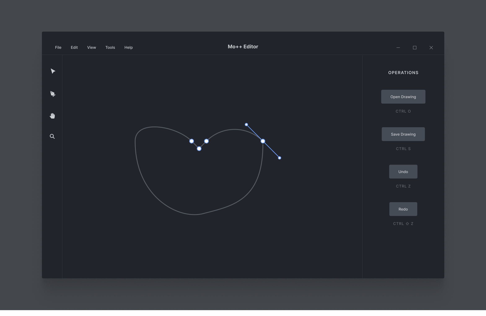

# Mo++

This prototype application demonstrates two major experimental functions:

1. Python/C++ based SVG manipulation and editing within a GUI
2. Frame-by-frame based SVG animation with keyframe support

The goal is to build a feature-rich and open-source SVG editor that makes creating motion graphics easy and intuitive, leveraging the power and speed of C++ and the flexibility of the Qt UI framework.

## SVG manipulation within a GUI

Traditionally, SVG manipulation has been restricted to either very bulky libraries (e.g. Skia), or to the web (e.g. HTML/CSS). Mo++ aims to take an alternative approach to SVG manipulation, whereby a lightweight custom-made library can be used to manipulate vector graphics - importantly, an approach that is platform and framework-independent.

The goals of Mo++ are as follows:

* Create a simple XML parser to implement the SVG spec
* Re-implementing SVG editing and DOM with C++ and Python
* Continuous rasterization of SVGs
* Development of a Python and Qt-based user interface for editing SVGs

## Frame-by-frame SVG animation

SVG animation tools typically rely on either the `<animate>` tag or embedded CSS/JS to perform SVG animations. Instead, Mo++ aims to create a sequence of individual SVG images, each of which is rendered and modified independently.

## Why C++ *and* Python?

C++ is awesome and fast, but suffers from memory leaks, compiling errors, broken dependencies, and is very tedious to debug. Thus, we decided to write the Qt UI using Python, while keeping the engine and associated libraries in C++.

## What's in the name?

Mo++ stands for "Motion Graphics in Python and C++". Oh yeah, the most descriptive name ever...

## License

Mo++ is, and always will be, free and open-source software. It is licensed under the [GPL v2 license](http://www.gnu.org/licenses/old-licenses/gpl-2.0.html), designed to protect users' freedom to run Mo++ however they wish.
